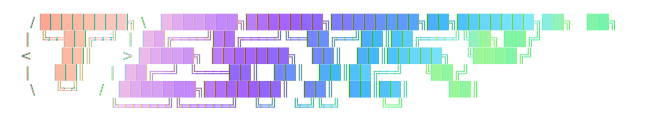

# Testify

**Zero-config API testing for your terminal.**


## The Problem

Postman and Insomnia require manual setup for every project: creating collections, typing URLs, guessing request bodies, and constantly switching context. Testify eliminates this busywork by statically analyzing your actual source code. It reads your codebase, finds your routes, infers your validation schemas, and provides an instant TUI workspace to test them immediately.

## What Testify Does

- Auto-detects your tech stack by reading `package.json`, `requirements.txt`, or `go.mod`
- Recursively scans your codebase for API routes across 10+ frameworks
- Pre-fills request bodies by following imports to find your actual Typescript DTOs and schemas
- Persistent split-pane workspace — edit request, see response, no context switching
- Works on monorepos, custom routes via `testify.json`, and maintains a full request history

## Supported Frameworks

| Language          | Frameworks                                 |
| ----------------- | ------------------------------------------ |
| **Node.js** | NestJS, Next.js, Express*, Fastify*, Hono* |
| **Python**  | FastAPI*, Flask*, Django*                  |
| **Go**      | Gin*, Echo*                                |

*\* pattern-implemented, less extensively tested against massive monoliths.*

## Installation

### Node Package Manager (NPM) (Recommended)

You can install Testify globally using npm:

```bash
npm install -g testify-api-cli
```

### Build from source

```bash
git clone https://github.com/nityam123-pixle/testify-cli.git
cd testify-cli
go build -o testify .

# Option A: Move to your PATH for global access
sudo mv testify /usr/local/bin/testify

# Option B: Run it locally in your project folder
./testify start
```

### Homebrew

You can install Testify via Homebrew:

```bash
brew tap nityam123-pixle/homebrew-testify
brew install testify-api-cli
```


### cURL (Linux & macOS)

You can install Testify with a single command — no Node or Homebrew required:

```bash
curl -fsSL https://raw.githubusercontent.com/nityam123-pixle/testify-cli/main/install.sh | bash
```

This script auto-detects your OS and CPU architecture, downloads the correct binary from the [latest GitHub release](https://github.com/nityam123-pixle/testify-cli/releases/latest), and installs it to `/usr/local/bin/testify`.

### PowerShell (Windows)

Open **PowerShell as Administrator** and run:

```powershell
iwr -useb https://raw.githubusercontent.com/nityam123-pixle/testify-cli/main/install.ps1 | iex
```

This script auto-detects your CPU architecture (`amd64` or `arm64`), downloads the correct `.zip` from the [latest GitHub release](https://github.com/nityam123-pixle/testify-cli/releases/latest), extracts it to `%LOCALAPPDATA%\Programs\testify`, and automatically adds it to your user `PATH`.

After installation, restart your terminal and run:

```powershell
testify version
```

> **Manual download**: You can also grab a `.zip` directly from the [Releases page](https://github.com/nityam123-pixle/testify-cli/releases) and add the folder to your PATH manually.

## Quick Start


Navigate to your backend project folder and run Testify:

```bash
cd your-project
testify start # (or ./testify start if you didn't move it to your PATH)
```

1. **Stack Detection**: Testify scans for `package.json`, `go.mod`, etc., to identify your framework and language.
2. **Route Scraping**: It recursively searches your source code, building an AST to extract endpoints and DTO schemas.
3. **Workspace**: An interactive TUI opens, pre-filled with your API routes and ready for you to send requests.

## Usage

| Command             | Description                                         |
| ------------------- | --------------------------------------------------- |
| `testify start`   | Start Testify in the current project                |
| `testify scan`    | Scan project and list detected routes               |
| `testify history` | View the last 20 test executions                    |
| `testify add`     | Interactively add a custom route to`testify.json` |
| `testify version` | Print the version number of Testify                 |
| `testify help`    | Help about any command                              |

## Configuration

Testify automatically infers the backend port by parsing your source code (e.g., `app.listen(3000)`). However, if you are running Testify on a remote production or staging server, you can override the base URL by injecting environment variables:

```bash
# Override the port
PORT=5000 testify

# Override the entire base URL
TESTIFY_URL=https://api.chatlyn.in testify
```

## Keyboard Shortcuts

| Key                | Action                                              |
| ------------------ | --------------------------------------------------- |
| `/`              | Open the Route Search Command Palette               |
| `Tab`            | Switch focus between Request Pane and Response Pane |
| `Ctrl+S`         | Send the current request                            |
| `1`              | View Response Body JSON                             |
| `2`              | View Response Headers                               |
| `3`              | View Raw HTTP Response                              |
| `c`              | Copy the active response view to clipboard          |
| `r`              | Clear the response pane                             |
| `Up` / `k`     | Scroll up the response pane                         |
| `Down` / `j`   | Scroll down the response pane                       |
| `PageUp`         | Fast scroll up                                      |
| `PageDown`       | Fast scroll down                                    |
| `Home`           | Scroll to top                                       |
| `Esc`            | Close route palette or defocus input                |
| `Ctrl+C` / `q` | Quit Testify                                        |

## Custom Routes (`testify.json`)

Sometimes routes are dynamically mounted by third-party libraries (like Better Auth) and cannot be statically detected in your source code. You can manually define these routes in a `testify.json` file in your project root.

You can add them interactively using the CLI:

```bash
testify add
```

Example `testify.json`:

```json
{
  "custom_routes": [
    {
      "method": "POST",
      "path": "/api/auth/sign-in/email",
      "description": "Better Auth - Email Sign In",
      "body_template": "{\n  \"email\": \"\",\n  \"password\": \"\"\n}"
    }
  ]
}
```

## Project Status

This is an actively developed personal project. The CLI engine is currently complete and stable (`v1.0.1`). The web-based UI Next.js frontend is currently in progress.

## Contributing

Issues and PRs are welcome! Please open an issue to discuss your ideas before submitting a PR to ensure it aligns with the project direction.

## License

This project is licensed under the **Apache License 2.0**. See the [LICENSE](LICENSE) file for details.

> [!WARNING]
> This is a proprietary open-source project. You are welcome to view, learn from, and contribute to the code. However, you may not copy, rebrand, or re-distribute this project or its core engine as your own product.
